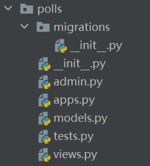

# 一 通过命令行来进行启动djange

### 1启动服务 8080 表示端口
python manage.py runserver 8080 
代码改变不需要重启 但是增减文件需要重启(官网)

# 二 增加模块(application) 
### 1模块的概念
```python
project 相当于一个大的项目 application相当于一个服务每一个app都书写在固定文件结构的文件夹中 
```
###  2每一个app都书写在固定文件结构的文件夹中，创建文件结构的指令为:
```python
#创建一个polls的application
python manage.py startapp polls
```
### 3创建的文件结构为:



# 三 写第一个view
试图的所有代码都卸载 view.py文件中 视图的作用同Java的controller层
在文件中写入试图:
```python
from django.http import HttpResponse
def index(request):
    return HttpResponse("hello django")
```
将视图和路由访问路径联系起来(局部配置+全局配置)
局部配置在polls下的urls文件中
```python
from django.urls import path
from . import views
urlpatterns = [
    path('', views.index, name="index")
]
```

全局配置 在djangoProject下的urls中
```python
from django.contrib import admin
from django.urls import include, path
urlpatterns = [
    path('polls/', include('polls.urls')),  # 引入别的文件的urls配置
    path('admin/', admin.site.urls),
]
```
注意:include() 方法可以引入配置文件 并且能够将polls/后的所有内容截断 交给配置文件urls进行匹配

# 四 数据库 model相关
### 1settings中配置有关数据库的配置
```python
DATABASES = {
    # 'default': {
    #     'ENGINE': 'django.db.backends.sqlite3',
    #     'NAME': BASE_DIR / 'db.sqlite3',
    # }
    'default': {
        'ENGINE': 'django.db.backends.mysql', #数据库的引擎
        'NAME': "lxp_test", #数据库的名字
        'USER': 'gzh',#用户名
        'PASSWORD': 'gzh',#密码
        'HOST': "172.16.10.32",#ip地址
        'OPTIONS': {'init_command': 'SET default_storage_engine=INNODB;'} #连接时参数
    }
}
```
### 2根据model创建数据库中的表
```python
#不需要手动的写creat语句 而是自动的搞
python manage.py migrate
```
注意:只有将应用注册在配置文件中的 INSTALLED_APPS 项中 才会创建表

### 3写自己的模型 
   模型的编写 在model.py 文件中写
```python 
from django.db import models
# Create your models here.
class Question(models.Model):
    # 没有写主键的时候会自动创建一个id主键
    question_text = models.CharField(max_length=30)
    pub_data = models.DateTimeField('data published')
class Choice(models.Model):
    question = models.ForeignKey(Question, on_delete=models.CASCADE)  # 外键的写法
    choice_text = models.CharField(max_length=30)
    votes = models.IntegerField(default=0)
```


# 根据模型创建表
```python
python manage.py makemigrations
python manage.py migrate 
```

# 五测试 
### 1 启动测试
第一种启动测试的方法
```python
启动 python manage.py shell
然后一行一行输入测试的命令 
```
第二种测试方法
在tests类中编写 注意必须以如下几行打头 启动django (可以封装为)
```python
pwd = os.path.dirname(os.path.realpath(__file__))
sys.path.append(pwd + "../")
os.environ.setdefault("DJANGO_SETTINGS_MODULE", "python_test.settings")
import django
django.setup()
```

## 六基于类的视图
看明白基于类的视图如何写，如何执行
as_view 弹出来一个方法 self.dispatch dispatch 分配到get,post上面 

django的执行流程(带中间件)
用户请求--->process_request(所有的)--->路由匹配--->process_view(所有的)---->用户自己的视图---process_response(所有的)
另外 返回的如果是render 搞模板 。发生异常要搞异常处理函数


源码流程梳理

一下内容关键看dispatch的源代码 以及写好的程序 仿照着写
认证
权限
限流
版本
解析器(request.data 获取解析后的数据 看源代码)
分页
视图
路由
渲染

更新发送请求 put 和patch

### os.path.join 可能会出现的错误
1 os.path.join(path1,path2 ,'/home')
最后一个绝对路径/home之前的所有路径都会被忽略
2 中间加入/ 还是\\ 与操作系统有关系