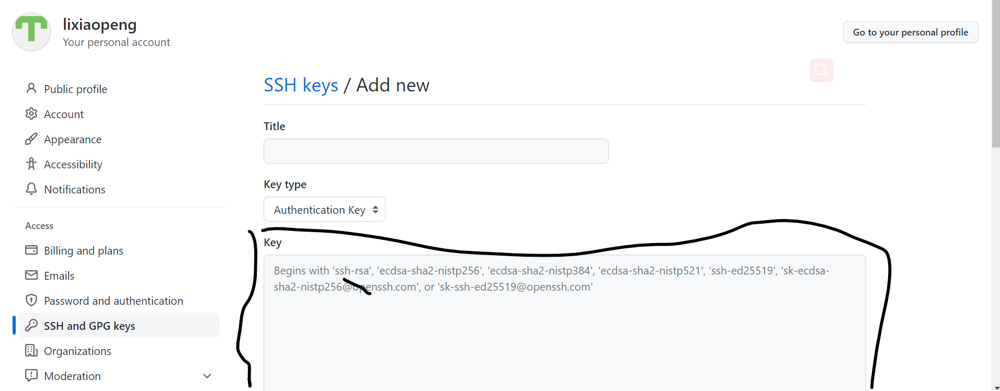

# git 向github提交数据 
问题:
Please make sure you have the correct access rights
and the repository exists.

问题原因:github 提交 需要一个公钥 (我也不大理解照做就行)

解决方式
```
1 首先要在本机生成一个公钥
ssh-keygen -t rsa -C "topgenQ/1390256375@qq.com"
2 生成的公钥存储在(lixiaopeng指的是用户名)
C:\Users\lixiaopeng\.ssh\id_rsa.pub
3 将公钥的内容写给github服务器(具体如图)
注意:如果不想让这个公钥的持有则提交代码 那么删除即可
```
